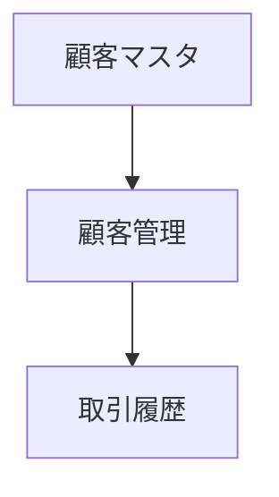

# kintoneアプリ現状整理ドキュメント

## 1. 基本情報
| 項目 | 内容 |
|------|------|
| アプリ名 | （例）顧客管理アプリ |
| アプリID | 〇〇 |
| 作成者 | 〇〇 |
| 最終更新者 | 〇〇 |
| 最終更新日 | yyyy/mm/dd |
| 所属スペース | 〇〇スペース |
| 利用ユーザー | 〇〇部門、〇〇チーム |

---

## 2. フィールド構成（概要）
| No | フィールド名 | フィールドコード | 種別 | 備考 |
|----|---------------|------------------|------|------|
| 1 | 顧客名 | CUSTOMER_NAME | 文字列(1行) | 必須項目 |
| 2 | 電話番号 | TEL | 文字列(1行) | - |
| 3 | メール | MAIL | 文字列(1行) | ルックアップ元にも使用 |
| 4 | 明細 | DETAILS | サブテーブル | 商品・金額など |

- **フィールド総数**：xx  
- **グループ数**：xx  
- **サブテーブル数**：xx  

---

## 3. ビュー構成（一覧／グラフ）
### 📋 一覧ビュー
| 名称 | 表示条件 | ソート | 表示項目 |
|------|-----------|--------|-----------|
| すべて | なし | 登録日時降順 | 顧客名／電話／メール |
| 有効顧客 | ステータス = 有効 | 顧客名／担当者 |  |

### 📈 グラフビュー
| 名称 | 種別 | 対象フィールド | 集計方法 |
|------|------|----------------|------------|
| 月別登録数 | 棒グラフ | 登録日 | COUNT |
| 担当者別顧客数 | 円グラフ | 担当者 | COUNT |

---

## 4. プロセス管理（ステータスとアクション）
| ステータス | 次のアクション | 条件 | 備考 |
|-------------|----------------|------|------|
| 新規 | 承認依頼へ | 常時可 | 登録直後 |
| 承認待ち | 承認済みへ | 承認者＝管理者 |  |
| 承認済み | 完了へ | 担当者＝営業 |  |

---

## 5. 通知・リマインダー設定
- コメント通知：〇〇部門に送信  
- レコード通知：ステータス変更時に通知  
- リマインダー：期限3日前に担当者へメール  

---

## 6. 関連アプリ・ルックアップ構成
| 種別 | 対象アプリ | フィールド | 関連条件 | 備考 |
|------|--------------|-------------|------------|------|
| ルックアップ | 顧客マスタ | 顧客ID | 顧客ID一致 | 顧客情報コピー |
| 関連レコード | 取引履歴 | 顧客ID | 顧客ID一致 | 関連履歴表示 |

**アプリ間構造図**

---

## 7. カスタマイズ／プラグイン構成
| 区分       | 名称                  | 用途               | 備考         |
| -------- | ------------------- | ---------------- | ---------- |
| JSカスタマイズ | customize.js        | 一覧画面での色分け        | Toolkitで管理 |
| プラグイン    | Lookup Color Marker | ルックアップ項目をハイライト表示 | 有効         |
| プラグイン    | AppInsight          | 構成可視化            |            |

---

## 8. 外部連携・Webhook
| 区分       | 接続先      | 内容       | 備考                 |
| -------- | -------- | -------- | ------------------ |
| Webhook  | Teams通知  | ステータス変更時 |                    |
| REST API | 外部システム登録 | 顧客情報送信   | POST /records.json |

---

## 9. 運用・管理メモ
- フィールド追加時はToolkitで構成更新を確認
- プロセス変更時はWebhook動作の再確認が必要
- 定期的にAppInsightでアプリ関係を再取得

---

## 10. 補足情報（改修履歴・課題）
| 日付         | 内容           | 担当 |
| ---------- | ------------ | -- |
| 2025/10/10 | ルックアップ自動取得追加 | 河合 |
| 2025/10/25 | 通知設定修正       | 佐藤 |
